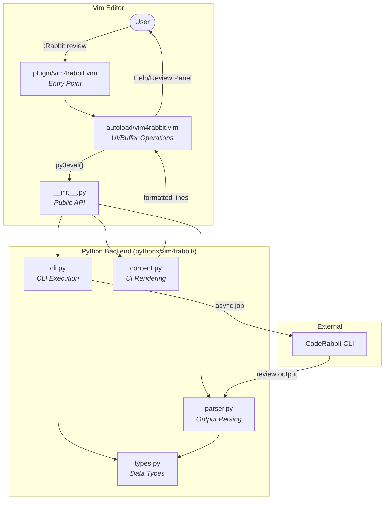

# vim4rabbit

A Vim plugin for running CodeRabbit code reviews directly in Vim.

## Features

- Run CodeRabbit reviews on uncommitted changes without leaving Vim
- Async execution with animated loading indicator
- Clean review panel with formatted output
- Help system with keybinding reference

## Installation

### Using Vundle

1. Add the following line to your `~/.vimrc` between `call vundle#begin()` and `call vundle#end()`:

```vim
Plugin 'davidpthomas/vim4rabbit'
```

2. Save the file and run:

```vim
:source %
:PluginInstall
```

Or restart Vim and run `:PluginInstall`.

### Manual Installation

Clone the repository into your Vim bundle directory:

```bash
git clone https://github.com/davidpthomas/vim4rabbit.git ~/.vim/bundle/vim4rabbit
```

## Usage

| Command | Description |
|---------|-------------|
| `:Rabbit` | Open the help panel (default) |
| `:Rabbit help` | Open the help panel |
| `:Rabbit review` | Run CodeRabbit review on uncommitted changes |

### Keybindings

In the help panel:
- `q` - Close the panel
- `ru` - Close help and run review

In the review panel:
- `q` - Close the panel
- `c` - Cancel the running review (while loading)

## Requirements

- Vim 8.0+ with Python 3 support (`+python3`)
- CodeRabbit CLI (see setup below)

## CodeRabbit CLI Setup

### Installation

Install the CodeRabbit CLI:

```bash
curl -fsSL https://cli.coderabbit.ai/install.sh | sh
```

Restart your shell or reload your configuration:

```bash
source ~/.zshrc  # or source ~/.bashrc
```

### Authentication

Connect your CodeRabbit account:

```bash
coderabbit auth login
```

Follow the browser prompt to authenticate and paste your access token back into the CLI.

### Verify Installation

Test the CLI is working:

```bash
coderabbit --help
```

For more information, see the [CodeRabbit CLI documentation](https://docs.coderabbit.ai/cli/overview).

## Architecture



### File Structure

```
vim4rabbit/
├── plugin/vim4rabbit.vim      # Plugin entry point, defines :Rabbit command
├── autoload/vim4rabbit.vim    # UI/buffer operations (VimScript)
└── pythonx/vim4rabbit/        # Python backend
    ├── __init__.py            # Public API for VimScript
    ├── cli.py                 # CodeRabbit CLI execution
    ├── parser.py              # Review output parsing
    ├── content.py             # UI content rendering
    └── types.py               # Data types
```

## Development

A Docker-based development environment is available:

```bash
# Build the development image
./dev/build.sh

# Run the development container
./dev/run.sh
```

### Running Tests

```bash
python -m pytest tests/ -v
```

## License

MIT
