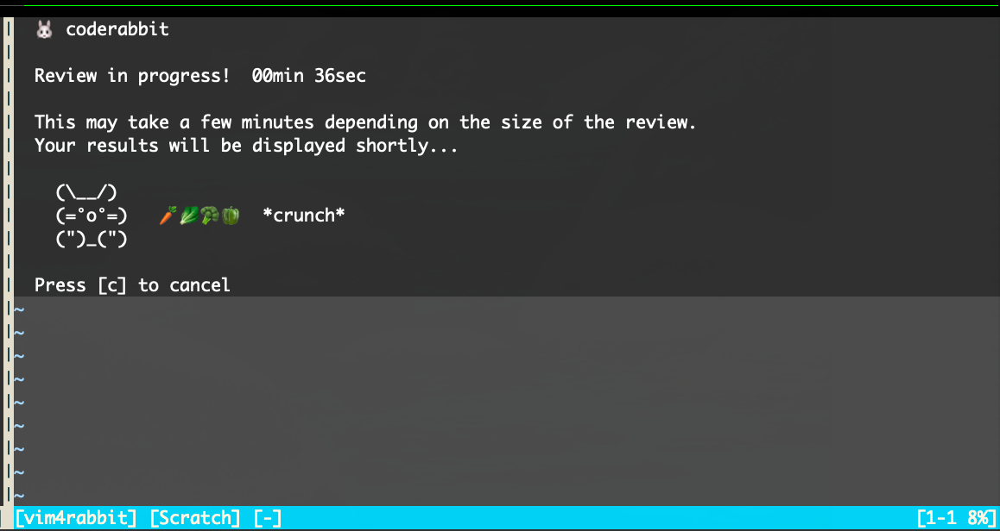
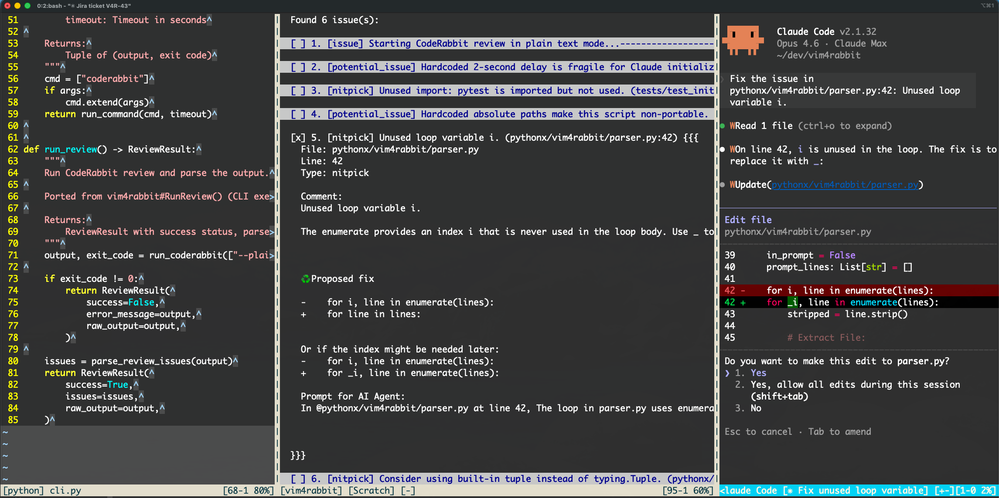

# vim4rabbit

A Vim plugin for running CodeRabbit code reviews directly in Vim and leveraging Claude Code to implement the fixes.

## Features

- Run CodeRabbit reviews on uncommitted, committed, or all changes without leaving Vim
- Three review modes: uncommitted, committed, and all (committed + uncommitted)
- Async execution with animated rabbit loading indicator and elapsed time tracking
- Interactive issue selection with checkboxes for targeted fixes
- Collapsible issue display using Vim folds
- Claude Code CLI integration to send selected issues for AI-powered fixes
- "No changes to review" jumping rabbit animation
- Help system with keybinding reference

### Developer Happiness

Working with AI-powered code reviews takes time. Rather than staring at a loading screen, vim4rabbit includes a handful of mini-games you can play while you wait. Some last less than a minute, others can keep you going for several minutes -- and you can cancel at any time. What matters most is that while you're waiting for your review results, you have space to think about what's coming next and plan your next set of changes.

## Screenshots

| Review In Progress | Issues Found | Full Workflow |
|:--:|:--:|:--:|
| <a href="doc/assets/coderabbit_review_in_progress.png"></a> | <a href="doc/assets/coderabbit_issue_found.png"></a> | <a href="doc/assets/vim_coderabbit_claude.png"></a> |
| Animated rabbit loading indicator with elapsed timer while a CodeRabbit review runs. | CodeRabbit review results with selectable issues and collapsible folds. | Source code, CodeRabbit review results with selectable issues, and Claude Code applying fixes side by side. |

## Installation

### Using Vundle

1. Add the following line to your `~/.vimrc` between `call vundle#begin()` and `call vundle#end()`:

```vim
Plugin 'davidpthomas/vim4rabbit'
```

2. Save the file and run:

```vim
:source %
:PluginInstall
```

Or restart Vim and run `:PluginInstall`.

### Manual Installation

Clone the repository into your Vim bundle directory:

```bash
git clone https://github.com/davidpthomas/vim4rabbit.git ~/.vim/bundle/vim4rabbit
```

## Usage

| Command | Description |
|---------|-------------|
| `:Rabbit` | Open the help panel (default) |
| `:Rabbit help` | Open the help panel |
| `:Rabbit review` | Run CodeRabbit review on uncommitted changes |
| `:Rabbit review uncommitted` | Run CodeRabbit review on uncommitted changes |
| `:Rabbit review committed` | Run CodeRabbit review on committed changes |
| `:Rabbit review all` | Run CodeRabbit review on all changes (committed + uncommitted) |

### Keybindings

In the help panel:
- `q` - Close the panel
- `ru` - Close help and run review on uncommitted changes
- `rc` - Close help and run review on committed changes
- `ra` - Close help and run review on all changes

In the review panel:
- `q` - Close the panel
- `c` - Cancel the running review (while loading)
- `<CR>` / `za` - Toggle fold on current issue
- `zM` - Close all folds
- `zR` - Open all folds
- `<Space>` - Toggle issue selection (checkbox)
- `\a` - Select all issues
- `\n` - Deselect all issues
- `\c` - Launch Claude Code with selected issues

## Requirements

- Vim 8.0+ with Python 3 support (`+python3`)
- CodeRabbit CLI (see setup below)
- Claude Code CLI (optional, for AI-powered fixes)

## CodeRabbit CLI Setup

### Installation

Install the CodeRabbit CLI:

```bash
curl -fsSL https://cli.coderabbit.ai/install.sh | sh
```

Restart your shell or reload your configuration:

```bash
source ~/.zshrc  # or source ~/.bashrc
```

### Authentication

Connect your CodeRabbit account:

```bash
coderabbit auth login
```

Follow the browser prompt to authenticate and paste your access token back into the CLI.

### Verify Installation

Test the CLI is working:

```bash
coderabbit --help
```

For more information, see the [CodeRabbit CLI documentation](https://docs.coderabbit.ai/cli/overview).

## Architecture

vim4rabbit uses a layered architecture separating UI (VimScript) from business logic (Python):

```
┌─────────────────────────────────────────────────────────────────┐
│                         Vim Editor                              │
│  :Rabbit review  :Rabbit help                                   │
└──────────────────────────┬──────────────────────────────────────┘
                           │
                           ▼
┌─────────────────────────────────────────────────────────────────┐
│                  VimScript UI Layer                             │
│  plugin/vim4rabbit.vim     Entry point, :Rabbit command         │
│  autoload/vim4rabbit.vim   Buffer management, async jobs,       │
│                            keybindings, animation timer,        │
│                            issue selection, Claude integration  │
└──────────────────────────┬──────────────────────────────────────┘
                           │ py3eval()
                           ▼
┌─────────────────────────────────────────────────────────────────┐
│                  Python Backend                                 │
│  pythonx/vim4rabbit/                                            │
│  ┌─────────────┐ ┌─────────────┐ ┌─────────────┐ ┌───────────┐  │
│  │ __init__.py │ │   cli.py    │ │  parser.py  │ │ content.py│  │
│  │ Public API  │ │ CLI runner  │ │ Output      │ │ Formatting│  │
│  │ for Vim     │ │             │ │ parsing     │ │ & render  │  │
│  └─────────────┘ └──────┬──────┘ └─────────────┘ └───────────┘  │
│                         │                                       │
│  types.py: ReviewIssue, ReviewResult data structures            │
└─────────────────────────┼───────────────────────────────────────┘
                          │ subprocess
                          ▼
┌─────────────────────────────────────────────────────────────────┐
│                  CodeRabbit CLI                                 │
│  coderabbit review --type {uncommitted|committed|all} --plain   │
└─────────────────────────────────────────────────────────────────┘
                          │
                          ▼ (selected issues)
┌─────────────────────────────────────────────────────────────────┐
│                  Claude Code CLI (optional)                     │
│  Launched in Vim terminal with selected issue prompts           │
└─────────────────────────────────────────────────────────────────┘
```

### Data Flow: `:Rabbit review`

```text
User runs :Rabbit review [type]
        │
        ▼
┌───────────────────┐     ┌───────────────────┐
│ Create review     │     │ Start async job   │
│ buffer (vsplit)   │────▶│ + animation timer │
└───────────────────┘     └─────────┬─────────┘
                                    │
                    ┌───────────────┼───────────────┐
                    │               │               │
                    ▼               ▼               ▼
             ┌───────────┐  ┌───────────┐   ┌───────────┐
             │ Animation │  │ Accumulate│   │ Job exit  │
             │ updates   │  │ output    │   │ callback  │
             │ (750ms)   │  │           │   │           │
             └───────────┘  └───────────┘   └─────┬─────┘
                                                  │
                                    ┌─────────────┼─────────────┐
                                    │             │             │
                                    ▼             ▼             ▼
                             ┌───────────┐ ┌───────────┐ ┌───────────┐
                             │ Success:  │ │ No files: │ │ Error:    │
                             │ Parse &   │ │ Jumping   │ │ Format    │
                             │ format    │ │ rabbit    │ │ error msg │
                             └─────┬─────┘ └───────────┘ └─────┬─────┘
                                   │                           │
                                   └─────────────┬─────────────┘
                                                 │
                                                 ▼
                                   ┌───────────────────────┐
                                   │ Display results in    │
                                   │ review buffer (folds) │
                                   └───────────┬───────────┘
                                               │
                                               ▼
                                   ┌───────────────────────┐
                                   │ User selects issues   │
                                   │ → Launch Claude Code  │
                                   └───────────────────────┘
```

### File Structure

```
vim4rabbit/
├── plugin/vim4rabbit.vim      # Plugin entry point, defines :Rabbit command
├── autoload/vim4rabbit.vim    # UI/buffer operations (VimScript)
├── pythonx/vim4rabbit/        # Python backend
│   ├── __init__.py            # Public API for VimScript
│   ├── cli.py                 # CodeRabbit CLI execution
│   ├── parser.py              # Review output parsing
│   ├── content.py             # UI content rendering
│   └── types.py               # Data types
├── doc/vim4rabbit.txt         # Vim help documentation
├── tests/                     # Test suite (pytest)
├── dev/                       # Docker development environment
│   ├── Dockerfile             # Development container
│   ├── build.sh               # Build script
│   └── run.sh                 # Run script
└── .coderabbit.yaml           # CodeRabbit configuration
```

## Development

A Docker-based development environment is available:

```bash
# Build the development image
./dev/build.sh

# Run the development container
./dev/run.sh
```

### Running Tests

```bash
./tests/runtests.sh
```

The test script runs the full test suite followed by a code coverage report showing per-file statement coverage and any uncovered lines.

## License

MIT
